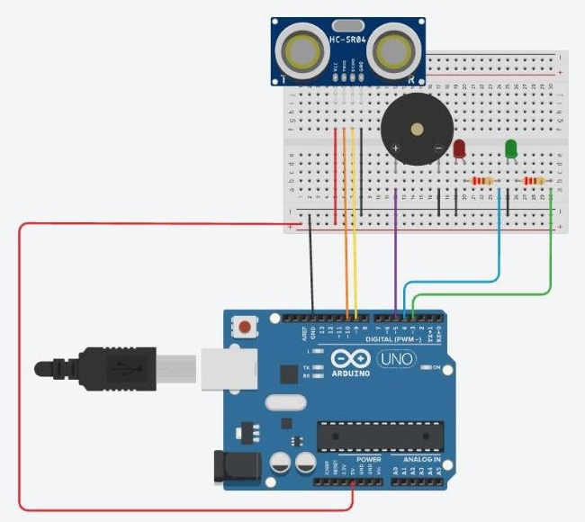
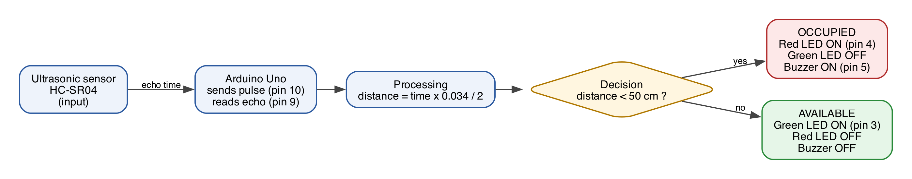
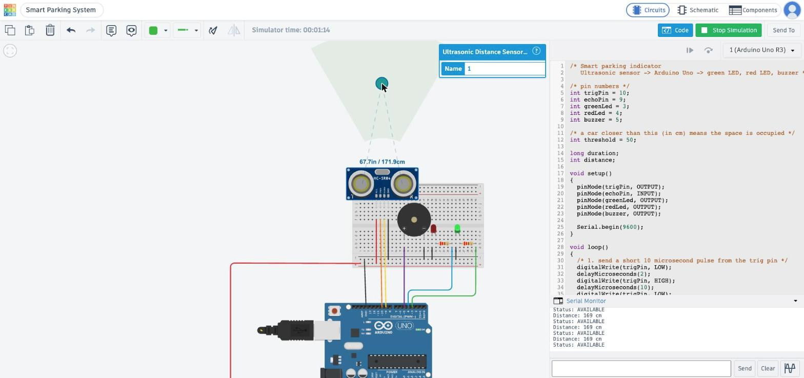
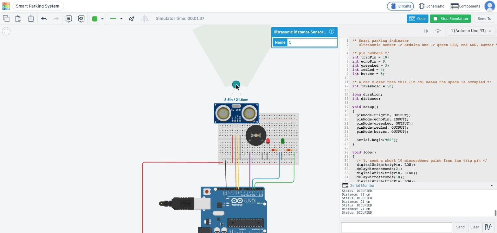
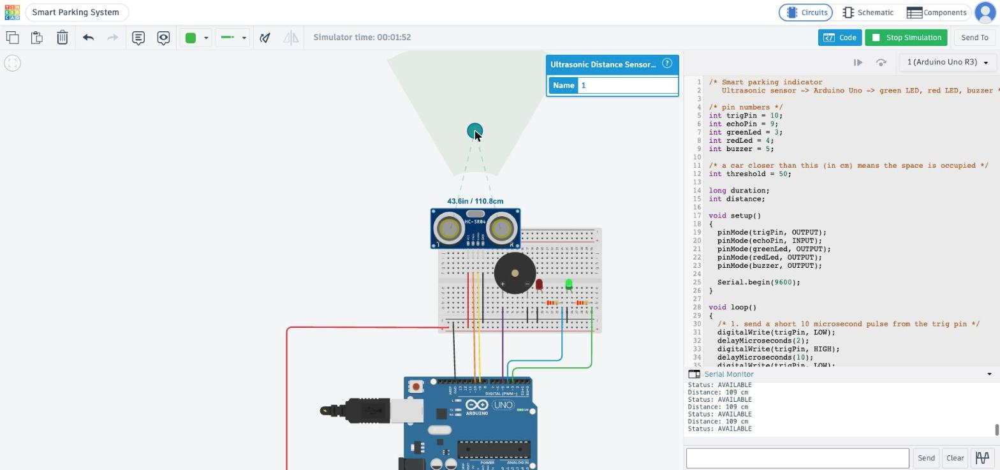

# Question 4: Arduino Smart Parking System

## 1. Tinkercad circuit design

I built everything on a small breadboard so the wiring stays tidy. Every wire has its own colour: black is GND, red is 5V, and each signal wire has a different colour.

| Part | Connected to |
|---|---|
| HC-SR04 ultrasonic sensor, VCC | 5V rail (red wire) |
| HC-SR04 TRIG | Arduino pin 10 (orange wire) |
| HC-SR04 ECHO | Arduino pin 9 (yellow wire) |
| HC-SR04 GND | GND rail (black wire) |
| Red LED | Arduino pin 4 through a 220 ohm resistor (blue wire), other leg to GND |
| Green LED | Arduino pin 3 through a 220 ohm resistor (green wire), other leg to GND |
| Piezo buzzer + | Arduino pin 5 (purple wire) |
| Piezo buzzer - | GND rail |
| Breadboard rails | Arduino 5V and GND |

## 2. Block diagram

## 3. Arduino source code

Source code: [`parking.ino`](parking.ino). It's the exact code running in the Tinkercad simulation.

I picked 50 cm as the threshold. If something is closer than 50 cm, a car is parked in the space. Anything further away is just the empty space or the wall behind it.

## 4. Simulation test cases

In Tinkercad, you click the sensor while the simulation runs and drag the little ball to change the distance. I did three tests and kept the Serial Monitor open to see the numbers.

| Test | Distance | Serial Monitor | Green | Red | Buzzer | OK? |
|---|---|---|---|---|---|---|
| 1. No car, far away | 171.9 cm | 169 cm, AVAILABLE | ON | OFF | OFF | Yes |
| 2. Car parked close | 21.6 cm | 21 cm, OCCUPIED | OFF | ON | ON (beeping) | Yes |
| 3. Car drives away again | 110.8 cm | 109 cm, AVAILABLE | ON | OFF | OFF | Yes |

Test 1: no car (171.9 cm), green LED on

Test 2: car close (21.6 cm), red LED on and buzzer sounding

Test 3: car leaves (110.8 cm), back to green

The number in the Serial Monitor is a bit lower than the one Tinkercad shows. That's because my code uses whole numbers and a rounded speed of sound, so it's close but not exact. It doesn't matter here, because all we care about is whether the car is closer or further than 50 cm.

## 5. Short explanation

### Role of each component

- Ultrasonic sensor (HC-SR04): the "eyes" of the system. It sends out a sound pulse that's too high for us to hear, and tells the Arduino how long the echo took to come back.
- Arduino Uno: the brain. It triggers the sensor, works out the distance, decides if the space is free, and switches the outputs on and off.
- Green LED: shows drivers the space is available.
- Red LED: shows the space is taken.
- Piezo buzzer: beeps when a car is in the space, as an extra alert.
- 220 ohm resistors: limit the current through each LED so they don't burn out.
- Breadboard: holds everything together and shares 5V and GND between the parts.

### How the sensor data is processed

1. The Arduino sets the TRIG pin HIGH for 10 microseconds. This makes the sensor send a sound pulse.
2. `pulseIn(echoPin, HIGH)` measures how long the ECHO pin stays HIGH. That's the time the sound took to reach the car and bounce back, in microseconds.
3. Sound moves about 0.034 cm every microsecond. The sound travels there and back, so the code divides by 2: `distance = duration * 0.034 / 2`.
4. The distance is printed to the Serial Monitor so we can see what the sensor is reading.

### How the Arduino controls the outputs

After working out the distance, the code uses one `if / else`:

- If `distance < 50`, the space is occupied. It turns the red LED on with `digitalWrite(redLed, HIGH)`, turns the green LED off, and starts the buzzer with `tone(buzzer, 1000)`, which is a 1000 Hz beep.
- Otherwise, the space is free. It turns the green LED on, turns the red one off, and stops the buzzer with `noTone(buzzer)`.

Then it waits half a second (`delay(500)`) and does it all again, so the lights update as soon as a car arrives or leaves.
