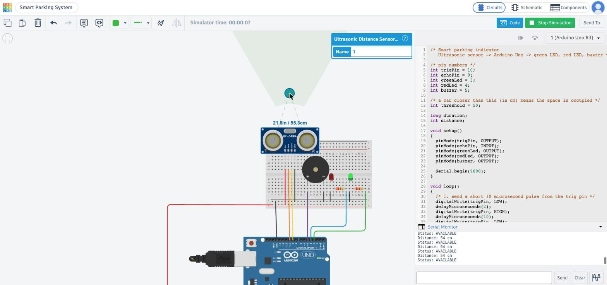

# Question 4: Arduino Smart Parking System

## Deliverables

| # | Deliverable (from the assignment) | Where |
|---|---|---|
| 1 | Tinkercad circuit design showing all components and connections | [Section 1](#1-tinkercad-circuit-design), [`images/circuit.jpg`](images/circuit.jpg), [live design on Tinkercad](https://www.tinkercad.com/things/af6CaRZ7KVX-smart-parking-system?sharecode=5jWkTN-CQHOvnFIWV-pHdCgkueqLRMvHqunsgteppko) |
| 2 | Block diagram showing the flow of data through the system | [Section 2](#2-block-diagram), [`images/block_diagram.png`](images/block_diagram.png) |
| 3 | Arduino source code used in the Tinkercad simulation | [Section 3](#3-arduino-source-code), [`parking.ino`](parking.ino) |
| 4 | At least two simulation test cases | [Section 4](#4-simulation-test-cases), five tests, two of them either side of the threshold, screenshots in [`images/`](images) |
| 5 | Short explanation describing the role of each component, how sensor data is processed, how the Arduino controls the outputs | [Section 5](#5-short-explanation) |

## 1. Tinkercad circuit design

Live design on Tinkercad: <https://www.tinkercad.com/things/af6CaRZ7KVX-smart-parking-system?sharecode=5jWkTN-CQHOvnFIWV-pHdCgkueqLRMvHqunsgteppko>

The circuit sits on a small breadboard. Black wires are GND, red wires are 5V, and each signal has its own colour.

| Part | Connected to |
|---|---|
| HC-SR04 ultrasonic sensor | VCC to 5V, TRIG to pin 10, ECHO to pin 9, GND to GND |
| Green LED | pin 3 through a 220 ohm resistor, other leg to GND |
| Red LED | pin 4 through a 220 ohm resistor, other leg to GND |
| Piezo buzzer | + to pin 5, - to GND |
| Breadboard rails | Arduino 5V and GND |

## 2. Block diagram

The Arduino sends a trigger pulse to the sensor on pin 10, and the sensor sends the echo time back on pin 9. The Arduino turns that time into a distance, compares it with 50 cm, and switches the LEDs and buzzer.

## 3. Arduino source code

Source code: [`parking.ino`](parking.ino). It's the exact code running in the Tinkercad simulation.

The threshold is 50 cm. Anything closer is a parked car, and anything further away is the empty space.

## 4. Simulation test cases

While the simulation runs, clicking the sensor lets you drag an object closer or further away. I ran five tests with the Serial Monitor open. Tests 4 and 5 sit just either side of the 50 cm threshold.

| Test | Distance | Serial Monitor | Green | Red | Buzzer |
|------------|------|----------|----|----|------|
| 1. No car | 171.9 cm | 169 cm, AVAILABLE | ON | OFF | OFF |
| 2. Car parked | 21.6 cm | 21 cm, OCCUPIED | OFF | ON | ON |
| 3. Car leaves | 110.8 cm | 109 cm, AVAILABLE | ON | OFF | OFF |
| 4. Just outside the threshold | 55.3 cm | 54 cm, AVAILABLE | ON | OFF | OFF |
| 5. Just inside the threshold | 45.4 cm | 44 cm, OCCUPIED | OFF | ON | ON |

Test 1: no car (171.9 cm), green LED on

Test 2: car close (21.6 cm), red LED on and buzzer sounding

Test 3: car leaves (110.8 cm), back to green

Test 4: just outside the threshold (55.3 cm), still green

Test 5: just inside the threshold (45.4 cm), red LED on and buzzer sounding

The Serial Monitor reads slightly below Tinkercad's distance because the code uses whole numbers and a rounded speed of sound. That never changes which side of 50 cm a reading falls on in these tests.

## 5. Short explanation

### Role of each component

The HC-SR04 sends an ultrasonic pulse and reports how long the echo takes to come back. The Arduino Uno runs the program: it triggers the sensor, works out the distance and switches the outputs. The green LED shows the space is free, the red LED shows it is taken, and the piezo buzzer sounds while a car is there. The 220 ohm resistors limit the current through the LEDs, and the breadboard shares 5V and GND between the parts.

### How the sensor data is processed

On every loop the Arduino sets TRIG high for 10 microseconds, which makes the sensor send a pulse. `pulseIn(echoPin, HIGH)` then measures how long ECHO stays high, which is the time the sound takes to reach the car and come back. Sound travels about 0.034 cm per microsecond and makes the trip twice, so the code uses `distance = duration * 0.034 / 2`. It prints the distance to the Serial Monitor.

### How the Arduino controls the outputs

One `if / else` makes the decision. If `distance < threshold` (50 cm), the red LED turns on, the green LED turns off, and `tone(buzzer, 1000)` plays a continuous 1000 Hz tone. Otherwise the green LED turns on, the red one turns off, and `noTone(buzzer)` stops the tone. After `delay(500)` the loop starts again, so the lights update about twice a second.
